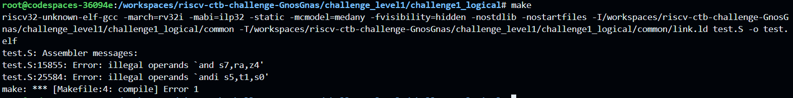
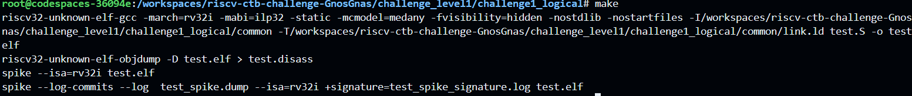

# Level 1 
## Challenge 1 - Logical

Error cause:    
Invalid instructions given at line 15855 and line 25584  

Reason and Fix:
1. Line 15855 - z4 is an invalid register operand so I used t4 instead
2. Line 25584 - andi cannot be used for and operation on two register operands so I changed it to and

