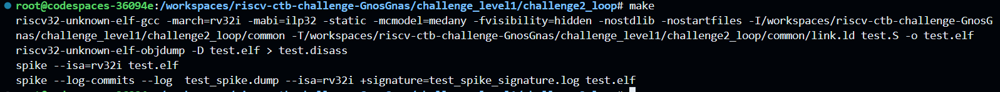

# Level 1 
## Challenge 2 - Loop

Bug image:

Error cause:   
More than the test data is being checked in the for loop    

Reason:    
Loop needs to run only for 3 sets of numbers and there was no end of loop

Fix:    
Added these two lines to end the loop after 3 testcases   

Now:

