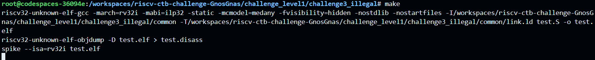
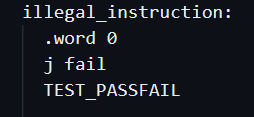
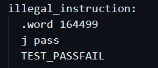
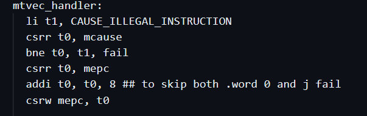

# Level 1 
## Challenge 3 - Illegal

Bug: The code hangs

Error cause:     
Illegal instruction was caused by .word 0 and was followed by j fail   

Reason and Fix:     
0 is not a valid instruction for this architecture and when encountered the trap handler mtvec_handler is getting invoked. Two solutions are possible:
1. Change the invalid instruction so that trap handler is not called    
    
Instead of instruction 0, we use instruction 164499 which corresponds to mv t0, t0. We also need to change j fail to j pass.
2. For silently skipping the invalid instruction, the trap handler can return to the next instruction    

