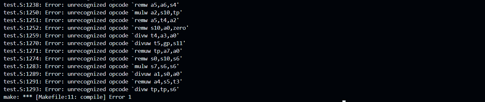
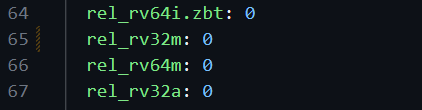
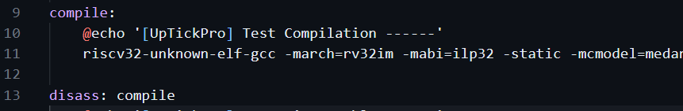
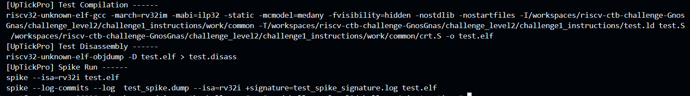

# Level 2   
## Challenge 1 - Instructions   

Bug: Compilation error   
  

Error cause:    
Invalid instructions were getting compiled    

Reason and Fix:   
1. In the rv32i.yaml, 64m instructions are being enabled to be generated. aapg can generated 64m instructions but the Makefile uses riscv32-unknown-elf-gcc to compile which can compile only 32-bit instructions. Hence, the distribution needs to be set to 0 for 64m (corresponding to mulw, divw, etc)
   

2. Another issue is if 32m was instead to be generated, then another flag is to be set. So for the make rule compile, pass "-march=rv32im" instead for the riscv compiler  

Scenario after fixing:   
