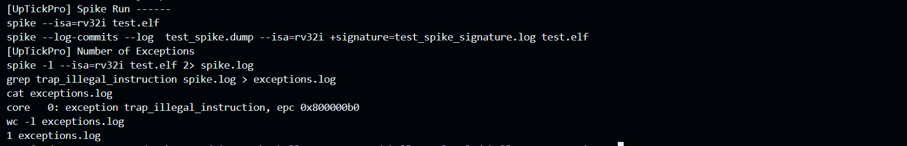
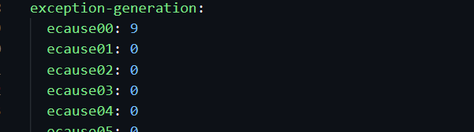
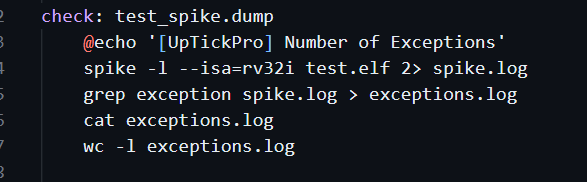
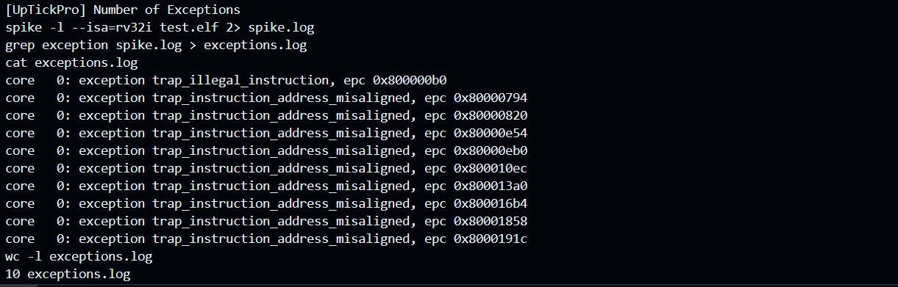

# Level 2   
## Challenge 2 - Exception   

Error cause: Aim is to generate 10 exceptions. Initial code generates only 1    
    

Explanation:   
The rv32i.yaml file doesn't specify to generate any exception and the command in the make rule check only checks for exceptions due to illegal instructions.  

Fix:
1. Changed ecause00 to 9 as already there was one exception getting created due to trap_illegal_instruction   
   
ecause00 was set because others were taking too much time to simulate.  
2. To count all exceptions, grep was changed to search for exception in the Makefile    
    

Now:

