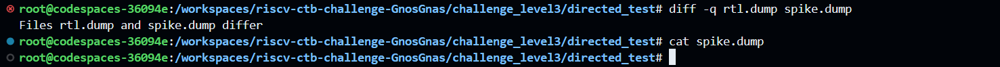
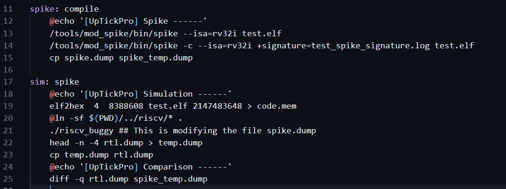
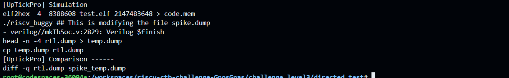
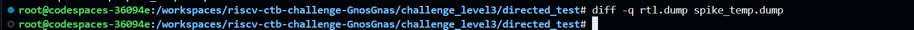

# Level 3   
## Challenge 1 - Directed Test   

Error cause: An empty spike.dump file was getting compared with rtl.dump   
     

Reason and Fix:
1. I found that riscv_buggy was tampering spike.dump which was generated by the make rule spike. Since the riscv_buggy can't be modified (its copied from riscv directoy), the fix was to move the contents of spike.dump to spike_temp.dump and then use it for comparison using the diff command
2. The diff command was slightly modified (added a flag -q) to make it more convenient for the user to detect bugs    
   

Working of it now: Now we can see that actually the two dump files match    
   

