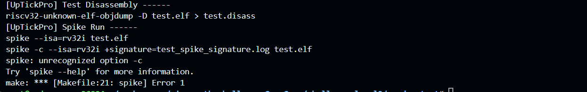
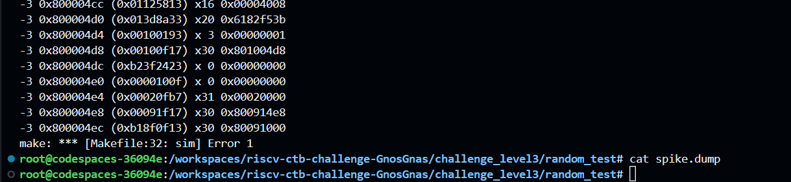
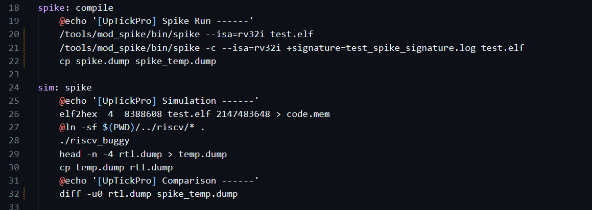
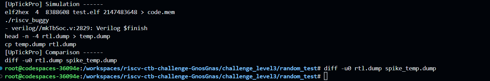

# Level 3   
## Challenge 2 - Random Test   

Error cause: Invalid flags for spike tool and comparison getting done with an empty spike.dump file   
1. Invalid flag for spike command
   
2. Empty spike.dump is being compared    
    

Reason and Fix:
1. Incorrect version of spike was used here so the path was properly specified in the Makefile    
2. Here too riscv_buggy was tampering spike.dump which was generated by the make rule spike. Since the riscv_buggy can't be modified (its copied from riscv directoy), the fix was to move the contents of spike.dump to spike_temp.dump and then use it for comparison using the diff command    
2. The diff command was slightly modified (added a flag -u0) to make it more convenient for the user to detect bugs which is present. rtl.dump is generated by riscv_buggy, and so can't be fixed of the bugs.   
   

Now:    
