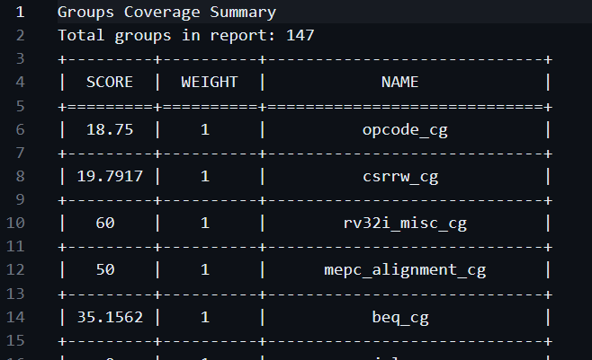
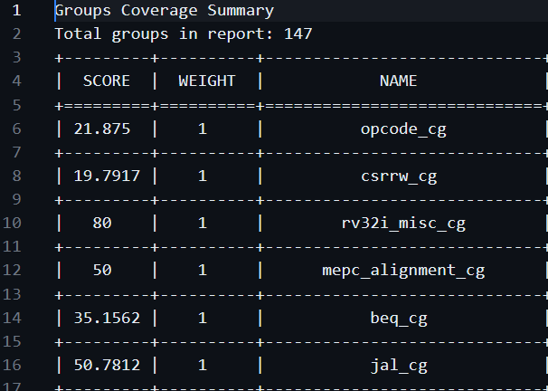
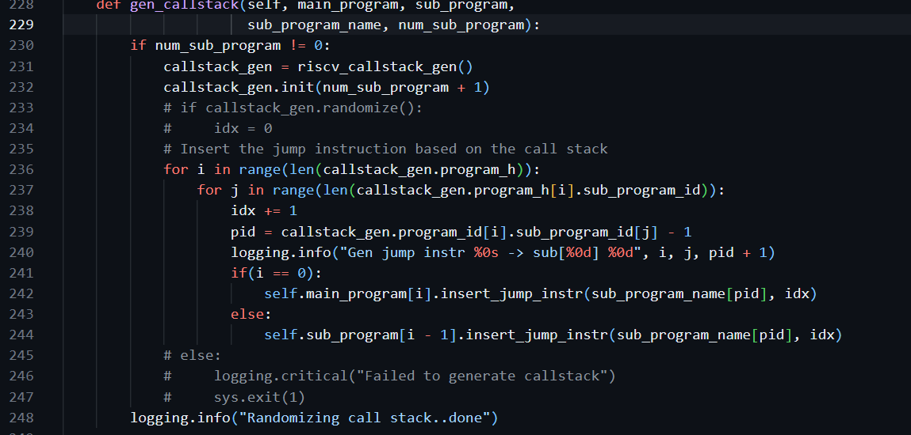
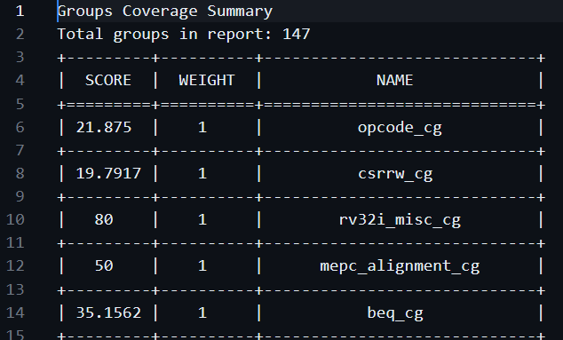
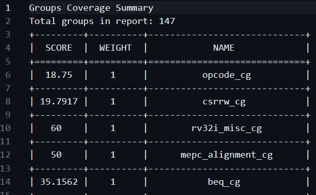
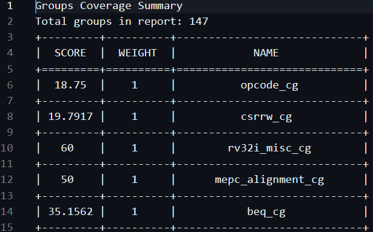

# RISCV-DV

Test generation using riscv-dv
```
run --target rv32i --test riscv_arithmetic_basic_test --testlist testlist.yaml --simulator pyflow
```

Coverage related information is obtained in the below link:
https://github.com/chipsalliance/riscv-dv/tree/master/pygen/pygen_src

# Challenge
The challenge is to fix the tool problem in generating coverage and make rv32i ISA coverage 100%

## Initial status
Coverage is used to verify the working of different cover groups of instructions based on if it covers all the coverpoints. I have identified many bugs in the riscv-dv tool and attempted to generate coverage reports for all

## Instructions to execute
Makefile contains these rules:
    all - to generate coverage reports for all tests
    riscv_arithmetic_basic_test - to generate coverage report for arithmetic basic test
    riscv_rand_instr_test: to generate coverage report for rand instr test
    riscv_loop_test: to generate coverage report for loop test
    riscv_jump_stress_test: to generate coverage report for jump stress test
    riscv_rand_jump_test: to generate coverage report for rand jump test
These 5 tests are specified in the testlist.yaml

## Problems and fixes:
1. Without any modification arithmetic test works. With higher instruction count a slight increase can be noticed for coverage.    
        
        
2. Next I tested was the jump stress test and it failed to generate.    
        
    The workaround for this was to first try by setting num_of_sub_program as 0 and this worked!
        
       
3. Now my aim was to fix the code for num_of_sub_program more than 0. After many attempts, I had to conclude that the common workaround for all tests is to do the following:
        
    Here the callstack.randomize() was removed to enable the flow.
4. To fix the other bugs, we shall go step by step over each bug and a possible reason. The bug as we can see from the error above is that the class object doesn't contain a variable callstack_gen and callstack_gen was defined as a local variable. So fix was:
        riscv_asm_program_gen.py (Line 232) - self.callstack_gen.init(num_sub_program + 1) -> callstack_gen.init(num_sub_program + 1)

    Executing the flow partially another error came up    
       
    riscv_program doesn't have __init__ defined to take parameters. So fix was:
        riscv_callstack_gen.py (Line 85) - self.program_h[i] = riscv_program("program_{}".format(i)) -> self.program_h[i] = riscv_program(); self.program_h[i].program_id = i   

    The next error which got exposed is this
        
    i is a value used later and for jump_instr of 1 it would fail. So fix was:
        riscv_instr_sequence.py (Line 273) - i = random.randrange(0, len(jump_instr) - 1) -> i = random.randrange(0, len(jump_instr))

    Next error was a very peculiar error where the generated asm files had two instructions whose operands were not separated by commas and the riscv tool threw them as errors:
       
    The bug was found in the code where addi and jalr instructions were added without the commas. So the fix was:
        riscv_instr_sequence.py (Line 267) - routine_str = prefix + "addi x{} x{} {}".format(ra.get_val(), cfg.ra, rand_lsb) -> routine_str = prefix + "addi x{}, x{}, {}".format(ra.get_val(), cfg.ra, rand_lsb)
        riscv_instr_sequence.py (Line 279) - routine_str = prefix + "jalr x{} x{} 0".format(ra.get_val(), ra.get_val()) -> routine_str = prefix + "jalr x{}, x{}, 0".format(ra.get_val(), ra.get_val())
    
    Now both jump stress test and rand jump tests works and Coverage reports are generated
        

5. Rand instr test doesn't work yet and the problem lies with the directed instr tools being passed. So the following params are removed to execute the rand instr test - riscv_loop_instr, riscv_hazard_instr_stream, riscv_multi_page_load_store_instr_stream, riscv_mem_region_stress_test   

    The bugs were identified by using this command where test was replaced with the above names
        python3 /tools/riscv-dv/pygen/pygen_src/test/riscv_instr_base_test.py --num_of_tests=1 --start_idx=0 --asm_file_name=riscv_rand_instr_test_out/asm_test/riscv_rand_instr_test --log_file_name=riscv_rand_instr_test_out/sim_riscv_rand_instr_test_0.log  --target=rv32i  --gen_test=riscv_instr_base_test --seed=850733344 --instr_cnt=1 --num_of_sub_program=0 --directed_instr_0=<type of test>,1  --disable_compressed_instr=1
    
    These bugs caused module vsc's randomize() function to fail which is critical for test generation and due to time constraint wasn't fixed 

    Removing the tests we get this error:
        
    The error is that some immediate value is getting mapped to some register address which should be valid. The errors were found to be in Store and Load handling in the code.
    riscv_cov_instr.py : 
    1. Original code for load and store instructions
        /// Code snippet from the python code
        if self.category.name == "STORE":
            self.rs2 = self.get_gpr(operands[0])
            self.rs2_value.set_val(self.get_gpr_state(operands[0]))
            self.rs1 = self.get_gpr(operands[2])
            self.rs1_value.set_val(self.get_gpr_state(operands[2]))
            self.imm.set_val(get_val(operands[1]))
        
        /// Code snippet from the python code
        if self.category.name == "LOAD":
            # load rd, imm(rs1)
            self.rs1 = self.get_gpr(operands[1])
            self.rs1_value.set_val(self.get_gpr_state(operands[1]))
            self.imm.set_val(get_val(operands[2]))

    2. New codes:
        if self.category.name == "STORE":
              # store rd, imm(rs1)
              self.rs1 = self.get_gpr(operands[1])
              self.rs1_value.set_val(self.get_gpr_state(operands[1]))
              self.imm.set_val(get_val(operands[2]))

        if self.category.name == "LOAD":
            # load rd, imm(rs1)
            self.rs1 = self.get_gpr(operands[2])
            self.rs1_value.set_val(self.get_gpr_state(operands[2]))
            self.imm.set_val(get_val(operands[1]))
    
    Now rand instr test works!!   
        

6. Loop test doesn't work with the other modifications as expected because loop set of instructions do not work as seen with rand test
    The bug is exposed using partial execution commands
       
    The exact bug is that the value of count is not being passed   
    

        

## Where to find Coverage reports
Inside cov, all Coverage Reports are present. Some reports generated for 0 sub programs are also saved in it